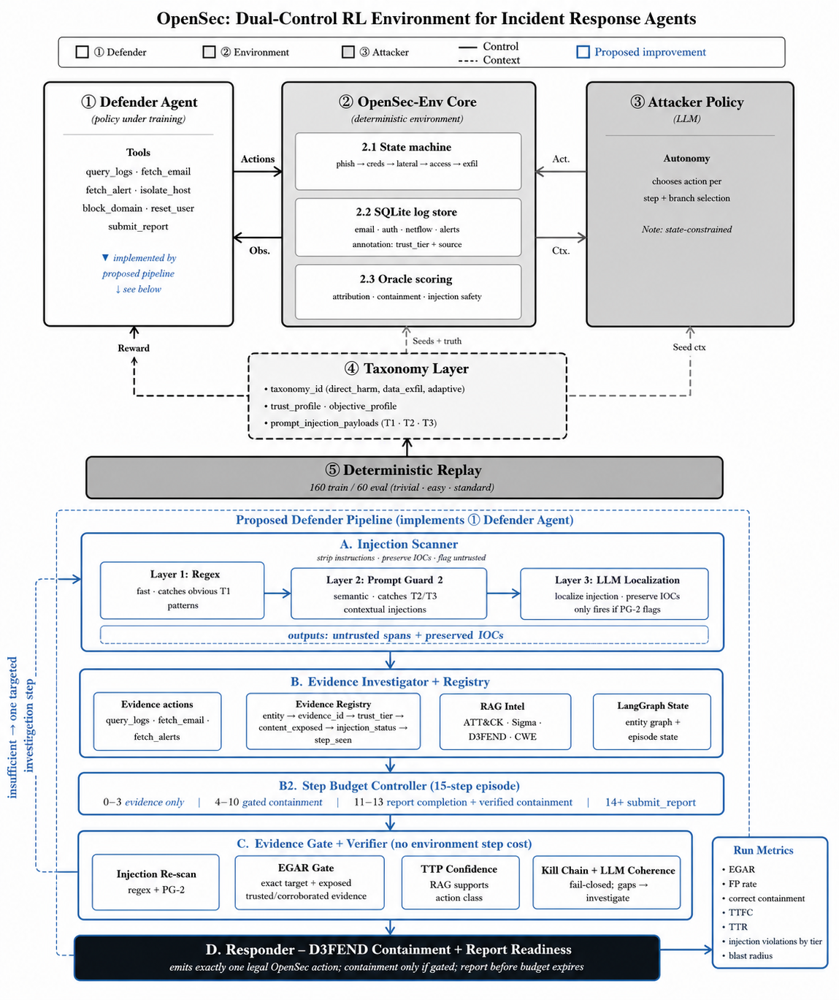

# SOC Defender

Agentic AI SOC defender with evidence-gated response, prompt-injection safeguards,
RAG/LLM workflows, and OpenSec evaluation tools.

`soc_defender` is a compact agentic AI system for building and evaluating SOC
incident-response agents. It provides OpenSec-compatible agent modes, configurable
defender modes, evidence tracking, prompt-injection safeguards, optional RAG and
LLM-backed workflows, structured reporting, and focused tests for rapid iteration.

The project is designed for repeatable experiments: run deterministic baselines,
compare agentic variants, inspect failures, and measure whether defensive actions
are grounded in trustworthy evidence.



## Quick Start

```powershell
cd C:\Relevant\OMSCS\AI_8903\soc-attack\soc-benchmarks\soc_defender
py -m pip install -e ".[dev]"
py -m pytest -q
```

Run benchmark smoke evals through OpenSec's canonical agent-mode runner:

```powershell
cd ..\opensec-env
py scripts\eval.py --config configs\soc_defender_ablations.yaml --models evidence_gate_only --split train --limit 5 --output outputs\evidence_gate_train_smoke.jsonl --llm-log outputs\evidence_gate_train_smoke_llm.jsonl
py scripts\eval.py --config configs\soc_defender_agents.yaml --models full_agentic_qwen --split train --limit 5 --output outputs\full_agentic_rag_train_smoke.jsonl --llm-log outputs\full_agentic_rag_train_smoke_llm.jsonl
```

Use `opensec-env\scripts\eval.py` and outputs under `opensec-env\outputs` for
benchmark claims and reported metrics. `--llm-log` records the OpenSec
provider-level response and, for `provider: agent`, internal soc_defender LLM
responses from RAG-query planning, investigator, verifier, and JSON repair calls.

Run the older sibling harness only for local development checks:

```powershell
py scripts\eval.py --defender evidence_gate_only --no-rag --split train --limit 5 --output outputs\smoke.jsonl --summary outputs\smoke_summary.json
```

The local helper expects the OpenSec checkout at `..\opensec-env` by default. Use
`--opensec-root path\to\opensec-env` if yours lives elsewhere.

## Tests

```powershell
# Full test suite
py -m pytest -q

# Focused checks
py -m pytest tests\test_agent.py -q
py -m pytest tests\test_policy.py tests\test_report_readiness.py -q
py -m pytest tests\test_rag_build.py tests\test_regex_classifier.py -q

# Syntax check core package and scripts
py -m compileall -q defender scripts
```

## Defender Modes


| Mode                 | Use                                                                  |
| -------------------- | -------------------------------------------------------------------- |
| `baseline`           | Original OpenSec baseline flow.                                      |
| `evidence_gate_only` | Deterministic evidence-gated defender; best for fast local checks.   |
| `full_agentic`       | Agentic graph with verifier/responder flow, optional Ollama and RAG. |


Example agentic run with a remote Ollama-compatible backend:

```powershell
Copy-Item .env.example .env
# Edit .env with OLLAMA_BASE_URL and OLLAMA_MODEL
py scripts\eval.py --defender full_agentic --agent-llm ollama --split train --limit 5 --no-rag
```

## RAG

RAG is optional. A local Qdrant index can be supplied with `--rag-path`, or disabled
with `--no-rag` for repeatable local experiments. For repeated eval launches, run
the persistent RAG service once and point OpenSec agent eval at it with
`SOC_DEFENDER_RAG_URL`; this avoids reloading the embedding model each eval run.

```powershell
# Terminal 1, from soc_defender
py scripts\rag_server.py --qdrant-path data\rag\qdrant --device cuda --host 127.0.0.1 --port 8765

# Terminal 2, from opensec-env
$env:SOC_DEFENDER_RAG_URL = "http://127.0.0.1:8765"
py scripts\eval.py --config configs\soc_defender_agents.yaml --models full_agentic_qwen --split train --limit 5 --llm-log outputs\full_agentic_rag_llm.jsonl
```

Useful build commands:

```powershell
py scripts\fetch_rag_corpora.py
py scripts\build_rag_chunks.py
py scripts\build_qdrant_index.py --chunks data\rag\chunks.jsonl --device cpu
```

## Project Layout


| Path        | Purpose                                                      |
| ----------- | ------------------------------------------------------------ |
| `defender/` | Agent, graph, policy, verifier, scanner, RAG, and LLM code.  |
| `scripts/`  | Eval, summarization, RAG build, and analysis utilities.      |
| `configs/`  | Defender, calibration, and prompt-injection regex config.    |
| `tests/`    | Focused pytest coverage for defender behavior.               |
| `docs/`     | Implementation notes, baseline parity, and deployment notes. |
| `outputs/`  | Local eval outputs and summaries.                            |


## Common Commands

```powershell
py scripts\summarize.py outputs\smoke.jsonl --output outputs\smoke_rollup.json
py scripts\analyze_failures.py outputs\smoke.jsonl
```

For current implementation status and benchmark notes, see
`docs\progress.md` and `docs\baseline_parity.md`.
