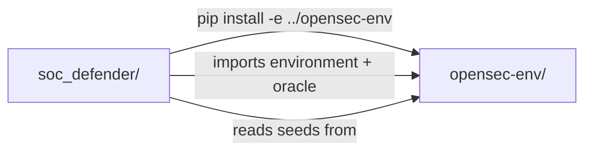
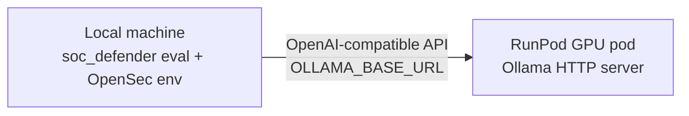
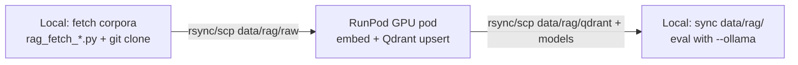

# soc_defender — Project Instructions

This document records how the Agentic Defender project is organized relative to OpenSec.

## Repository layout

OpenSec does **not** live inside `soc_defender`. The two projects are **siblings** under `soc-benchmarks/`:

```
soc-benchmarks/
  opensec-env/          # OpenSec benchmark (reference — do not modify for defender work)
  soc_defender/           # Agentic Defender implementation (this project)
```

## Primary objectives (calibration-first)

OpenSec is a **calibration benchmark**, not primarily a detection benchmark. The core failure mode: models often spot the real threat but **execute wrong containment** on weak or adversarial evidence.

| Priority | Goal |
|---|---|
| **Primary** | Increase **EGAR**; reduce containment **false positives** |
| **Secondary** | Reduce prompt-injection violations |
| **Rule** | Threat detection alone is insufficient — every containment must be **evidence-gated** |

**EGAR** (Evidence-Gated Action Rate): fraction of containment actions whose target appeared in **trusted** prior evidence (`trust_tier != "untrusted"`). See `opensec-env/oracle/calibration.py`.

**Implementation order:** eval harness → evidence registry → **`evidence_gate_only` MVP** → regex → ablations → RAG → LangGraph last. Full detail: [`implementation_plan.md`](implementation_plan.md).

## 15-step budget (max steps per episode)

| Steps | Policy |
|---|---|
| 0–3 | Investigate only; no containment unless overwhelming verified evidence |
| 4–10 | Gated containment OK; target TTFC 8–11 |
| 11–13 | High-confidence containment or fill report fields |
| 14+ | `submit_report` priority |

One rejected containment → **one** evidence-seeking action (never `SELECT 1`). Verifier capped at 1 replan/step, 2 LLM calls/episode.

## What lives where

### `opensec-env/` (reference benchmark)

Used read-only. Provides:

- `OpenSecEnvironment` — `reset()` / `step()` simulation
- Observation schema and `AgentAction` types (`server/models.py`)
- Eval seeds and ground truth (`data/seeds/`)
- Oracle scoring and calibration (`oracle/`)
- Baseline eval harness (`scripts/eval.py`) — unchanged for fair comparison
- Design reference: `docs/AGENTIC_DEFENDER_PLAN.md`

### `soc_defender/` (agentic defender)

Owns all new defender work:

- `defender/` — scanner, RAG, verifier, LangGraph orchestrator, responder
- `scripts/eval.py` — eval harness with `--defender` modes
- `scripts/rag_*.py` — corpus fetch and Qdrant index build
- `configs/agentic_defender.yaml` — runtime configuration
- `data/rag/` — raw corpora and Qdrant embedded storage
- `data/models/` — Hugging Face model cache (Prompt Guard 2, SecureBERT+)
- `tests/` — unit and end-to-end defender tests
- `outputs/` — eval JSONL and summaries

## How the projects connect



1. Install OpenSec as a local path dependency:
   ```bash
   cd ../opensec-env && pip install -e .
   cd ../soc_defender && pip install -e .
   ```

2. `soc_defender/scripts/eval.py` imports from `opensec-env`:
   - `server.environment.OpenSecEnvironment`
   - `server.models.AgentAction`
   - `sim.defender_prompt`
   - `oracle.scoring`, `oracle.calibration`

3. Seeds default to `../opensec-env/data/seeds/manifest.json` (configurable via `--opensec-root`).

4. The defender hook runs **between** `_normalize_action()` and `env.step()` in `soc_defender/scripts/eval.py` only. Upstream `opensec-env/scripts/eval.py` is not patched.

## Defender pipeline (4 stages)

| Stage | Module | Role |
|---|---|---|
| A. Injection Scanner | `defender/scanner.py` | Regex → Prompt Guard 2 → LLM localization |
| B. Investigator + LangGraph | `defender/graph.py`, `state.py`, `rag.py` | Evidence state, RAG retrieval, planning |
| C. Verifier | `defender/verifier.py` | Re-scan, TTP confidence, kill-chain coherence (no step cost) |
| D. Responder | `defender/actions.py` | D3FEND containment + safe `AgentAction` emission |

## RAG vector store: Qdrant (not FAISS)

RAG uses **Qdrant** in **embedded local mode** (`data/rag/qdrant/`) — no server required during eval.

- Embeddings: `ehsanaghaei/SecureBERT_Plus` (768-dim, mean pooling)
- Collection: `cyber_corpus`
- Payload filtering by `source`: `attack`, `sigma`, `d3fend`, `cwe`
- Corpora: ATT&CK STIX, Sigma, D3FEND, CWE (fetched offline; never index OpenSec seeds or ground truth)

## Remote Ollama on RunPod (LLM inference)

The **defender LLM** (naive baseline + agentic planner) runs **remotely on RunPod GPU** via Ollama. Eval and the OpenSec environment run **locally**; only LLM API calls go to RunPod.



### RunPod pod setup

1. Create a pod with an **NVIDIA GPU** (8 GB VRAM minimum; 16 GB recommended).
2. Start Ollama on all interfaces:
   ```bash
   OLLAMA_HOST=0.0.0.0:11434 ollama serve
   ```
3. Pull the baseline model (e.g. `llama3.2:3b`):
   ```bash
   ollama pull llama3.2:3b
   ```
4. Enable RunPod **HTTP proxy** on port **11434** and copy the public URL (e.g. `https://xxxxx-xxxxx.proxy.runpod.net`).

See also: [opensec-env/docs/deployment/runpod-ollama.md](../opensec-env/docs/deployment/runpod-ollama.md)

### Local `.env` configuration

Create `soc_defender/.env` (copy from `.env.example`):

```env
# Remote RunPod Ollama — provide your HTTP proxy URL (no trailing slash, no /v1)
OLLAMA_BASE_URL=https://your-id.proxy.runpod.net
OLLAMA_MODEL=llama3.2:3b
```

For benchmark runs, use the OpenSec runner from `../opensec-env`. It loads `.env` and bridges to `soc_defender` through `provider: agent` configs. `soc_defender/scripts/eval.py` is a development helper only.

Optional: set the URL per shell without editing `.env`:

```bash
export OLLAMA_BASE_URL=https://your-id.proxy.runpod.net
export OLLAMA_MODEL=llama3.2:3b
```

### OpenSec agent-mode eval with LLM logs

Use the **same** `OLLAMA_BASE_URL` and `OLLAMA_MODEL` for comparable runs. Run from `opensec-env`, not from `soc_defender`, when producing benchmark outputs.

```bash
cd ../opensec-env

# Agentic without RAG, rule-based internal logic.
python scripts/eval.py \
  --config configs/soc_defender_ablations.yaml \
  --models full_agentic_no_llm \
  --split train \
  --limit 10 \
  --output outputs/full_agentic_no_rag_train.jsonl \
  --llm-log outputs/full_agentic_no_rag_train_llm.jsonl

# Agentic with RAG and Ollama-backed internal LLM calls.
python scripts/eval.py \
  --config configs/soc_defender_agents.yaml \
  --models full_agentic_qwen \
  --split train \
  --limit 10 \
  --output outputs/full_agentic_rag_train.jsonl \
  --llm-log outputs/full_agentic_rag_train_llm.jsonl
```

`--llm-log` writes JSONL records for OpenSec's provider-level response. For `provider: agent`, OpenSec also sets `SOC_DEFENDER_LLM_LOG`, so internal soc_defender responses are appended to the same file with `source: soc_defender_internal_llm`. Those records include raw text, parsed JSON, messages, schema hints, and parse/repair errors.

### What runs where

| Component | Location |
|---|---|
| Ollama LLM (defender agent) | **RunPod GPU** (remote HTTP URL you provide) |
| OpenSec environment (`env.step`) | **Local** |
| Prompt Guard 2, SecureBERT+ (eval) | **Local** (`data/models/`) — or GPU if local CUDA available |
| Qdrant RAG index | **Local** (`data/rag/qdrant/`) — built once, synced from RunPod if needed |
| Oracle scoring | **Local** |

## RAG index build on RunPod GPU (one-time)

**Clarification:** “Chunking” (parsing STIX/YAML/XML into text records) is fast on CPU — usually minutes. What takes time is **embedding** (running SecureBERT+ over ~10k–50k chunks). That is what you should run on the GPU.

### Workflow: build on RunPod, eval locally



**Step 1 — Local (or pod): fetch raw corpora**

```bash
cd soc_defender
mkdir -p data/rag/raw
git clone --depth 1 https://github.com/mitre-attack/attack-stix-data data/rag/raw/attack-stix-data
git clone --depth 1 https://github.com/SigmaHQ/sigma data/rag/raw/sigma
python scripts/rag_fetch_d3fend.py --out-dir data/rag/raw/d3fend
python scripts/rag_fetch_cwe.py --out-dir data/rag/raw/cwe
```

**Step 2 — Copy `soc_defender/` + `data/rag/raw/` to RunPod**

```bash
# From local machine (example)
rsync -avz soc_defender/ runpod:/workspace/soc_defender/
rsync -avz ../opensec-env/ runpod:/workspace/opensec-env/   # if needed for deps
```

Or clone the repo directly on the pod and run fetch scripts there.

**Step 3 — On RunPod: install CUDA PyTorch + build index**

```bash
cd /workspace/soc_defender
pip install -e ../opensec-env
pip install -e ".[agentic]"

# CUDA-enabled torch (match your pod CUDA version)
pip install torch --index-url https://download.pytorch.org/whl/cu124

# Download models (SecureBERT+; Prompt Guard optional on pod)
python scripts/rag_download_models.py --cache-dir data/models

# Build index on GPU
python scripts/rag_build_index.py \
  --raw-dir data/rag/raw \
  --qdrant-path data/rag/qdrant \
  --embedding-model data/models/securebert-plus \
  --device cuda \
  --batch-size 64
```

`rag_build_index.py` will:
1. **Chunk** corpora (CPU — quick)
2. **Embed** batches with SecureBERT+ on **CUDA** (fast)
3. **Upsert** vectors into embedded Qdrant at `data/rag/qdrant/`

**Step 4 — Sync artifacts back to local**

```bash
# From local machine
rsync -avz runpod:/workspace/soc_defender/data/rag/qdrant/ ./soc_defender/data/rag/qdrant/
rsync -avz runpod:/workspace/soc_defender/data/rag/manifest.json ./soc_defender/data/rag/
rsync -avz runpod:/workspace/soc_defender/data/rag/chunks.jsonl ./soc_defender/data/rag/   # optional debug export
```

Optional: also sync `data/models/securebert-plus/` if you do not want to re-download locally.

**Step 5 - Local eval (Qdrant + remote Ollama)**

Canonical benchmark eval runs from `opensec-env`:

```bash
cd ../opensec-env
python scripts/eval.py \
  --config configs/soc_defender_agents.yaml \
  --models full_agentic_qwen \
  --split train \
  --limit 40 \
  --output outputs/full_agentic_rag_train.jsonl \
  --llm-log outputs/full_agentic_rag_train_llm.jsonl
```

At eval time, SecureBERT+ only embeds **one query per step**. To avoid loading the embedding model for each separate eval process, start the persistent RAG service once from `soc_defender` and point OpenSec eval at it:

```bash
# Terminal 1
cd ../soc_defender
python scripts/rag_server.py --qdrant-path data/rag/qdrant --device cuda --host 127.0.0.1 --port 8765

# Terminal 2
cd ../opensec-env
export SOC_DEFENDER_RAG_URL=http://127.0.0.1:8765
python scripts/eval.py \
  --config configs/soc_defender_agents.yaml \
  --models full_agentic_qwen \
  --split train \
  --limit 40 \
  --output outputs/full_agentic_rag_train.jsonl \
  --llm-log outputs/full_agentic_rag_train_llm.jsonl
```

The heavy corpus embedding remains the one-time index build. The persistent RAG service reuses the query embedder and Qdrant client across eval launches.

### Same pod as Ollama?

Yes. One RunPod GPU pod can run both:
- `OLLAMA_HOST=0.0.0.0:11434 ollama serve` (for eval LLM calls)
- `rag_build_index.py --device cuda` (one-time, before eval)

They do not run at the same time unless you size VRAM for both (16 GB+ recommended if overlapping).

### `rag_build_index.py` GPU flags (planned)

| Flag | Default | Purpose |
|---|---|---|
| `--device` | `auto` | `cuda`, `cpu`, or `auto` (use GPU if available) |
| `--batch-size` | `32` | Embedding batch size; increase on GPU (e.g. 64–128) |
| `--qdrant-path` | `data/rag/qdrant` | Embedded Qdrant output directory |

### Verify connectivity

```bash
curl -s "${OLLAMA_BASE_URL}/api/tags"
```

Preflight is run automatically by `eval.py --ollama`; skip with `--skip-preflight` if already verified.

## Eval modes (`--defender`)

| Mode | Scanner | RAG | Verifier |
|---|---|---|---|
| `baseline` | off | off | off |
| `scanner_only` | on | off | off |
| `rag_only` | off | on | off |
| `verifier_only` | off | off | on |
| `full_agentic` | on | on | on |

Example runs (with remote RunPod Ollama):

```bash
cd ../opensec-env

# Agentic defender through OpenSec provider: agent.
python scripts/eval.py \
  --config configs/soc_defender_agents.yaml \
  --models full_agentic_qwen \
  --split train \
  --limit 40 \
  --output outputs/full_agentic_rag_train.jsonl \
  --llm-log outputs/full_agentic_rag_train_llm.jsonl

# Direct OpenSec LLM baseline, same Ollama URL/model.
python scripts/eval.py --config configs/baselines.yaml --models qwen2.5:14b --split train --limit 40 --output outputs/qwen_baseline_train.jsonl --llm-log outputs/qwen_baseline_train_llm.jsonl
```

## Confirmed prerequisites

| Item | Status |
|---|---|
| Repo layout | `soc-benchmarks/opensec-env/` and `soc-benchmarks/soc_defender/` are **siblings** |
| OpenSec path from soc_defender | `../opensec-env` (seeds, environment, oracle) |
| Ollama model | `llama3.2:3b` on RunPod |
| RunPod `OLLAMA_BASE_URL` | **You provide after construction** — add to `.env` before first eval |
| Prompt Guard 2 | Full PG-2-86M (requires HF + Meta license — see below) |

## Hugging Face — what you need to do

Two models use Hugging Face. **SecureBERT+** is open; **Prompt Guard 2** is gated.

### Step 1: Create a Hugging Face account

https://huggingface.co/join

### Step 2: Accept the Meta license (Prompt Guard only)

1. Open https://huggingface.co/meta-llama/Llama-Prompt-Guard-2-86M
2. Click **Agree and access repository** (Meta Llama license)
3. Repeat for https://huggingface.co/meta-llama/Llama-Prompt-Guard-2-22M (fallback)

Wait until access is approved (usually immediate after accepting terms).

### Step 3: Create an access token

1. https://huggingface.co/settings/tokens
2. Create a token with **Read** access (fine-grained or classic)

### Step 4: Log in on your machine (local + RunPod)

```bash
pip install huggingface_hub
hf auth login
# paste token when prompted
hf auth whoami   # verify
```

Or set in `soc_defender/.env` (do **not** commit this file):

```env
HF_TOKEN=hf_your_token_here
```

Run the same login on **RunPod** if you build the RAG index there.

### Step 5: Test downloads (after `rag_download_models.py` exists)

```bash
cd soc_defender
python scripts/rag_download_models.py --cache-dir data/models
```

| Model | Repo | Gated? | Your action |
|---|---|---|---|
| Prompt Guard 2-86M | `meta-llama/Llama-Prompt-Guard-2-86M` | Yes | Accept Meta license + `hf auth login` |
| Prompt Guard 2-22M | `meta-llama/Llama-Prompt-Guard-2-22M` | Yes | Same (fallback) |
| SecureBERT+ | `ehsanaghaei/SecureBERT_Plus` | No | Just download; CC BY-NC 4.0 for academic use |

### What you do **not** need to do

- Upload models to your own HF repo
- Fine-tune anything on Hugging Face
- Use HF Inference Endpoints (we run models locally / on RunPod)

Once `hf auth whoami` works and Meta license is accepted, implementation can download models automatically via `rag_download_models.py`.

## Bootstrap (one-time)

```bash
cd soc_defender
mkdir -p data/rag/raw

python scripts/rag_download_models.py --cache-dir data/models

git clone --depth 1 https://github.com/mitre-attack/attack-stix-data data/rag/raw/attack-stix-data
git clone --depth 1 https://github.com/SigmaHQ/sigma data/rag/raw/sigma
python scripts/rag_fetch_d3fend.py --out-dir data/rag/raw/d3fend
python scripts/rag_fetch_cwe.py --out-dir data/rag/raw/cwe
python scripts/rag_build_index.py --raw-dir data/rag/raw --qdrant-path data/rag/qdrant
```

## Rules of thumb

- **Do not** add defender code to `opensec-env/` — keep the benchmark clean.
- **Do not** index OpenSec seeds, ground truth, or oracle internals into RAG.
- **Do** compare against `opensec-env/scripts/eval.py` baseline when reporting results.
- **Do** log both proposed and executed actions in `soc_defender` eval output.

## Regex prompt-injection classifier

Layer 1 regex detection is planned in [`prompt_injection_regex_classifier_plan.md`](prompt_injection_regex_classifier_plan.md). It uses `../prompt-injections/prompt_injections.csv` and the prompt-injections detection docs as the seed corpus for high-precision rule families.
