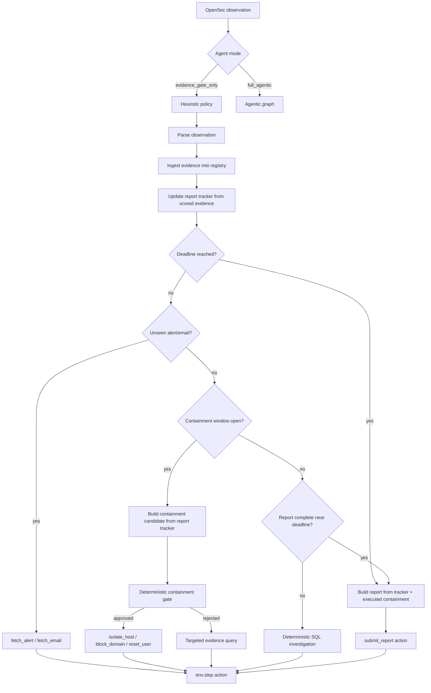
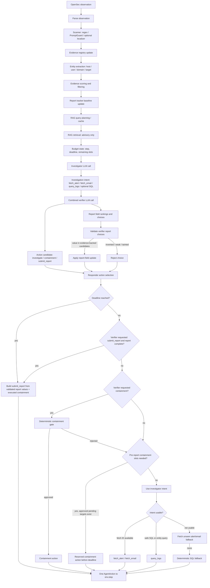
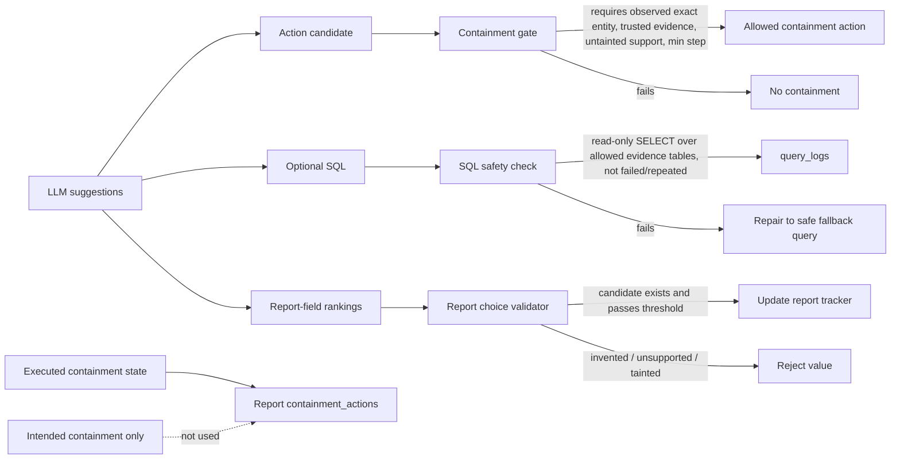
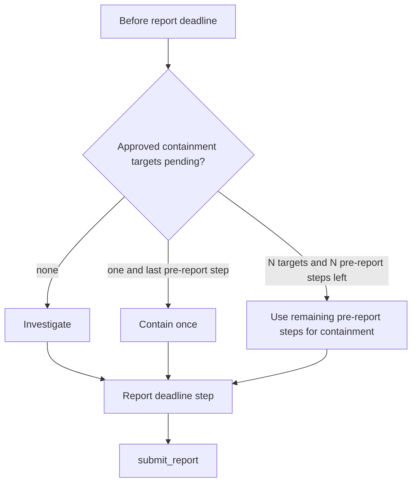

# Present Flow Diagram

## High-Level Mode Split

```mermaid
flowchart TD
    A[OpenSec observation] --> B{Agent mode}
    B -->|evidence_gate_only| H1[Heuristic policy]
    B -->|full_agentic| F1[Agentic graph]

    H1 --> H2[Parse observation]
    H2 --> H3[Ingest evidence into registry]
    H3 --> H4[Update report tracker from scored evidence]
    H4 --> H5{Deadline reached?}
    H5 -->|yes| H6[Build report from tracker + executed containment]
    H6 --> Z[submit_report action]
    H5 -->|no| H7{Unseen alert/email?}
    H7 -->|yes| H8[fetch_alert / fetch_email]
    H7 -->|no| H9{Containment window open?}
    H9 -->|yes| H10[Build containment candidate from report tracker]
    H10 --> H11[Deterministic containment gate]
    H11 -->|approved| H12[isolate_host / block_domain / reset_user]
    H11 -->|rejected| H13[Targeted evidence query]
    H9 -->|no| H14{Report complete near deadline?}
    H14 -->|yes| H6
    H14 -->|no| H15[Deterministic SQL investigation]

    H8 --> Y[env.step action]
    H12 --> Y
    H13 --> Y
    H15 --> Y
    Z --> Y
```

## Full-Agentic Flow

```mermaid
flowchart TD
    A[OpenSec observation] --> P[Parse observation]
    P --> S[Scanner: regex / PromptGuard / optional localizer]
    S --> R[Evidence registry update]
    R --> E[Entity extraction: host / user / domain / target]
    E --> SC[Evidence scoring and filtering]
    SC --> RT[Report tracker baseline update]

    RT --> RQ[RAG query planning / cache]
    RQ --> RG[RAG retrieval: advisory only]
    RG --> B[Budget state: step, deadline, remaining slots]

    B --> I[Investigator LLM call]
    I --> II[Investigation intent: fetch_alert / fetch_email / query_logs / optional SQL]

    II --> V[Combined verifier LLM call]
    V --> VC[Action candidate: investigate / containment / submit_report]
    V --> VR[Report field rankings and choices]

    VR --> RV[Validate verifier report choices]
    RV -->|value in evidence-backed candidates| RU[Apply report-field update]
    RV -->|invented / weak / tainted| RR[Reject choice]

    VC --> RS[Responder action selection]
    RU --> RS
    RR --> RS

    RS --> D{Deadline reached?}
    D -->|yes| REP[Build submit_report from validated report values + executed containment]
    D -->|no| C1{Verifier requested submit_report and report complete?}
    C1 -->|yes| REP
    C1 -->|no| C2{Verifier requested containment?}

    C2 -->|yes| G[Deterministic containment gate]
    G -->|approved| CA[Containment action]
    G -->|rejected| C3{Pre-report containment slots needed?}
    C2 -->|no| C3

    C3 -->|yes, approved pending targets exist| PC[Reserved containment action before deadline]
    C3 -->|no| IA[Use investigator intent]

    IA --> IF{Intent usable?}
    IF -->|fetch ID available| FA[fetch_alert / fetch_email]
    IF -->|safe SQL or entity query| QA[query_logs]
    IF -->|not usable| UF[Fetch unseen alert/email fallback]
    UF -->|none| DF[Deterministic SQL fallback]

    REP --> OUT[One AgentAction to env.step]
    CA --> OUT
    PC --> OUT
    FA --> OUT
    QA --> OUT
    DF --> OUT
```

## Safety And Validation Boundaries

```mermaid
flowchart LR
    LLM[LLM suggestions] --> A[Action candidate]
    LLM --> Q[Optional SQL]
    LLM --> RF[Report-field rankings]

    A --> CG[Containment gate]
    CG -->|requires observed exact entity, trusted evidence, untainted support, min step| ACT[Allowed containment action]
    CG -->|fails| NO1[No containment]

    Q --> SQL[SQL safety check]
    SQL -->|read-only SELECT over allowed evidence tables, not failed/repeated| QUERY[query_logs]
    SQL -->|fails| REPAIR[Repair to safe fallback query]

    RF --> RVAL[Report choice validator]
    RVAL -->|candidate exists and passes threshold| ROK[Update report tracker]
    RVAL -->|invented / unsupported / tainted| RNO[Reject value]

    EXEC[Executed containment state] --> REP[Report containment_actions]
    INTENT[Intended containment only] -.not used.-> REP
```

## Step Timing Rule

```mermaid
flowchart TD
    A[Before report deadline] --> B{Approved containment targets pending?}
    B -->|none| C[Investigate]
    B -->|one and last pre-report step| D[Contain once]
    B -->|N targets and N pre-report steps left| E[Use remaining pre-report steps for containment]
    C --> F[Report deadline step]
    D --> F
    E --> F
    F --> G[submit_report]
```
